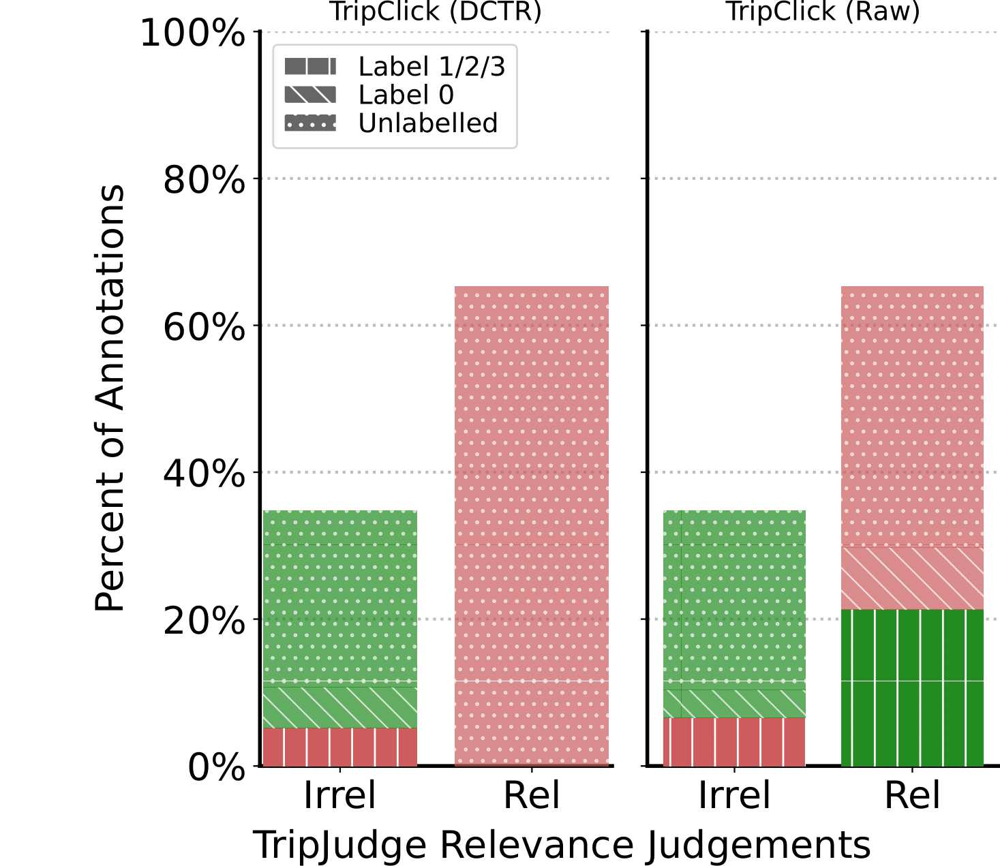
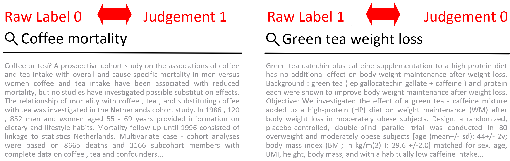

# TripJudge: Relevance Judgement Test Collection for TripClick

TripJudge is a novel relevance judgement based test collection for the [Tripclick](https://tripdatabase.github.io/tripclick/)
health retrieval collection. We extend the click-based test sets by annotating Head test set queries with a pool of 
3 runs from [Hofstätter et al.](https://arxiv.org/abs/2201.00365)
(BM25, dense retrieval with SciBERT_DOT and an neural Ensemble re-ranking).
 
We ensure a high quality by employing 2.92 judgements on average for every query-document pair and continuous 
monitoring of quality parameters during our annotation campaign, such as the time spent per annotation. 
For relevance judgement we employ majority voting and reach a moderate inter-annotator agreement.

We compare the TripJudge relevance judgements to the click-based labels from the TripClick 
DCTR and Raw labels and find a low coverage of the Top4 runs of our pool. Furthermore 
we find disagreement between our relevance judgements and click-based labels, as visualized in the plot below.
Green bars denote agreement, red bars denote disagreement in the plot below.

In the following we see a text example of 2 queries with the retrieved document, where the Raw click-based
labels and the TripJudge judgement disagree. For the left example, the click-based label considers the document irrelevant
while we judge it relevant, for the right example, the click-based label considers the document as relevant, while we judge
the document as irrelevant.

## Test collection

We publish the **12,590** TripJudge relevance judgements 
for [2 class relevance](data/qrels_2class.txt) and the [4 class relevance](data/qrels_4class.txt).

We also publish the **38,810** query-document [raw annotations](data/raw-judgements-fira-22-final.tsv) with annotation times and anonymized user ids
to encourage further research on this test collection.

## Acknowledgements

We want to thank our students of the Advanced Information Retrieval course in the summer term of 2022 for annotating the data and being so patient and motivated in the process. 