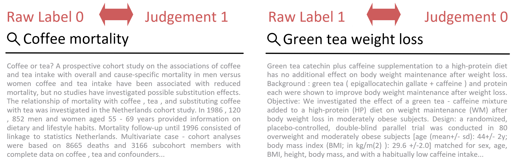

# TripJudge: Relevance Judgement Test Collection for TripClick

TripJudge is a novel relevance judgement based test collection for the [Tripclick](https://tripdatabase.github.io/tripclick/)
health retrieval collection. We extend the click-based test sets by annotating Head test set queries with a pool of 
3 runs from [Hofstätter et al.](https://arxiv.org/abs/2201.00365)
(BM25, dense retrieval with SciBERT_DOT and an neural Ensemble re-ranking) and publish the [qrels](data) from the relevance judgements.

We ensure a high quality by employing multiple judgements on average for every query-document pair and continuous 
monitoring of quality parameters during our annotation campaign, such as the time spent per annotation. 
For relevance judgement we employ majority voting and reach a moderate inter-annotator agreement.

Please cite our work as follows
```
@inproceedings{althammer2022tripjudge,
author = {Althammer, Sophia and Hofst\"{a}tter, Sebastian and Verberne, Suzan and Hanbury, Allan},
title = {TripJudge: A Relevance Judgement Test Collection for TripClick Health Retrieval},
year = {2022},
isbn = {9781450392365},
publisher = {Association for Computing Machinery},
address = {New York, NY, USA},
url = {https://doi.org/10.1145/3511808.3557714},
doi = {10.1145/3511808.3557714},
booktitle = {Proceedings of the 31st ACM International Conference on Information &amp; Knowledge Management},
pages = {3801–3805},
numpages = {5},
location = {Atlanta, GA, USA},
series = {CIKM '22}
}
```

We compare the TripJudge relevance judgements to the click-based labels from the TripClick 
DCTR and Raw labels and find a low coverage of the Top4 runs of our pool. Furthermore 
we find disagreement between our relevance judgements and click-based labels, as visualized in the plot below.
Green bars denote agreement, red bars denote disagreement in the plot below.
<p align="left">

</p>

In the following we see a text example of 2 queries with the retrieved document, where the Raw click-based
labels and the TripJudge judgement disagree. For the left example, the click-based label considers the document irrelevant
while we judge it relevant, for the right example, the click-based label considers the document as relevant, while we judge
the document as irrelevant.




## Test collection

We publish the **12,590** TripJudge relevance judgements 
for [2 class relevance](data/qrels_2class.txt) and the [4 class relevance](data/qrels_4class.txt).

We also publish the **38,810** query-document [raw annotations](data/raw-judgements-fira-22-final2.tsv) with annotation times and anonymized user ids
to encourage further research on this test collection.

The judgements where created using:
- a 4-graded relevance scheme
- at least 2, on average 2.92 judgements per query-document pair
- achieving moderate inter-annotator agreement
- monitoring the annotation time per annotator

The published raw annotations are the judgements for all 1175 TripClick head test queries.
We clean the test set by removing queries that are duplicates (only differ in casing) or non-sense queries (for example '#1 and #2'), the
[reasons for removal](preprocessing/reasons%20for%20removals.xlsx) can be found in the [preprocessing](preprocessing) folder, 
as well as the [removed](preprocessing/queries_remove_cleaned.tsv) and [remaining](preprocessing/queries_remain_cleaned.tsv) queries.

The qrels are generated using the [following script](annotation/generate_qrels.py), where queries are cleaned and the majority and heuristic voting is applied.

We preprocess the documents for the annotation campaign by truncating them to the length of 512 BERT tokens. The [preprocessing script](preprocessing/trip_preprocessing.py)
is published as well.


## Annotation guidelines

The annotation guidelines given to the annotators were the following:

Welcome to Fira! Our goal is to create fine-grained relevance annotations for query - document snippet pairs.

In the annotation interface you will see 1 query and 1 document snippet and a range of relevance classes to select.


For each pair you must select 1 from 4 relevance classes:
- <b>Wrong</b> If the document has nothing to do with the query, and does not help in any way to answer it
- <b>Topic</b> If the document talks about the general area or topic of a query, might provide some background info, but ultimately does not answer it
- <b>Partial</b> The document contains a partial answer, but you think that there should be more to it
- <b>Perfect</b> The document contains a full answer: easy to understand and it directly answers the question in full

Important annotation guidelines and Fira usage tips:

<b>(1)</b> You should use your general knowledge to deduce links between query and answers, but if you don't know what the question (or part of it such as an acronym) means, " +
        'fall back to see if the document clearly explains the question and answer and if not score it as <b>Wrong</b> or <b>Topic</b> only. We do not assume specific domain knowledge requirements.

<b>(2)</b> For <b>Partial</b> and <b>Perfect</b> grades you need to select the text spans, that are in fact the relevant text parts to the questions. You can select multiple words (the span) with 
your mouse or by once tapping or clicking on the start and once on the end of the span.
You can select more than one and you can also select them before clicking on the grade button.

Now before we get started, let's have a look at an example from each relevance grade:


## Acknowledgements

We thank our students of the Advanced Information Retrieval course in SS2022 for annotating the data and being so patient and motivated in the process. 
